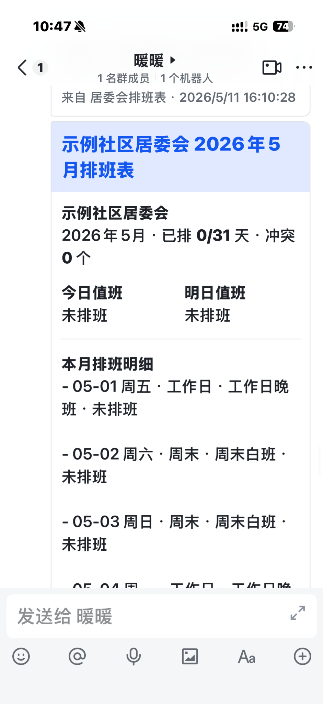
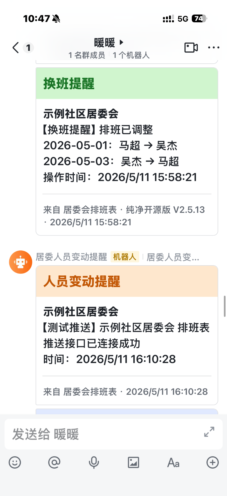
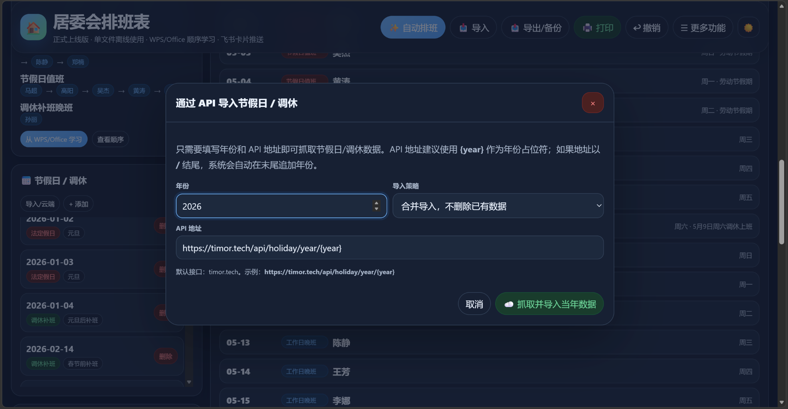

# 🏠 居委会排班表 · 正式飞书版

> 一个专为社区、居委会、办公室值班和小团队轮值场景设计的 **纯前端单文件排班工具**。  
> 支持自动排班、WPS / Office 表格导入、节假日与调休管理、请假冲突检测、打印归档、JSON 备份、飞书卡片推送等功能。

<p align="center">
  
  
  
  
</p>

---

## 📌 项目简介

**居委会排班表** 是一个面向基层社区、居委会、街道办公室、物业值班、小团队轮值等场景的轻量化排班系统。

它最大的特点是：

- ✅ 不需要数据库
- ✅ 不需要后端服务
- ✅ 不需要安装复杂环境
- ✅ 下载后打开 `index.html` 就能用
- ✅ 可离线使用
- ✅ 可部署到 GitHub Pages / Cloudflare Pages / Vercel / NAS / Nginx / Docker

相比普通 Excel / WPS 表格，它更适合长期维护排班，因为它可以记录人员、请假、节假日、调休、历史顺序，并支持自动排班和飞书推送。

---

## 🖼️ 项目截图预览

### 📱 手机端：飞书排班卡片



---

### 📱 手机端：换班提醒与机器人测试推送



---

### 🖥️ 桌面端：主界面与日历排班


---

### 🧠 桌面端：排班顺序学习


---

### 🎌 桌面端：节假日 / 调休 API 导入



---

## ✨ 核心优点

### 1. 单文件运行，开箱即用

本项目是纯 HTML / CSS / JavaScript 实现，核心文件只有一个：

```text
index.html
```

只要浏览器能打开网页，就能运行这个排班表。

适合：

- 居委会办公室电脑
- 内网办公环境
- 飞牛 OS / NAS
- 1Panel 静态站点
- Nginx 静态网页
- GitHub Pages
- Cloudflare Pages
- Vercel

---

### 2. 日历式排班，更直观

排班采用月历视图展示，不再是一长串表格。

可以直观看到：

- 今天谁值班
- 明天谁值班
- 本月已排多少天
- 是否有请假冲突
- 工作日晚班
- 周末白班
- 节假日值班
- 调休补班晚班

不同班次类型有不同颜色标识，查看起来更清楚。

---

### 3. 自动排班，减少手动工作量

支持自动生成排班，适合每月固定值班、人员轮转、节假日值班等场景。

自动排班可以结合：

- 人员列表
- 历史排班顺序
- 节假日数据
- 调休补班数据
- 请假记录
- 停用人员状态

对于每月都要做排班表的场景，可以明显减少重复劳动。

---

### 4. WPS / Office 顺序学习

可以从旧排班表中学习人员轮转顺序。

适合这种情况：

> 以前一直用 WPS / Excel 做排班，现在想迁移到这个工具，但又不想重新设置顺序。

工具可以从旧表中识别：

- 通用顺序
- 工作日晚班顺序
- 周末白班顺序
- 节假日值班顺序
- 调休补班晚班顺序

后续自动排班会尽量延续原来的排班习惯。

---

### 5. 请假记录与冲突提醒

支持添加请假记录，并自动检测冲突。

可以识别：

- 请假人员仍被安排值班
- 停用人员仍被安排值班
- 某天无人值班
- 自动排班后出现异常

发现冲突后，可以使用“修复冲突”辅助处理。

---

### 6. 节假日 / 调休管理

支持维护节假日、休息日、调休补班日。

可以手动添加，也可以通过 API 导入节假日 / 调休数据。

支持的日期类型包括：

| 类型 | 说明 |
|---|---|
| 法定假日 | 按节假日值班处理 |
| 休息日 | 按节假日或周末值班处理 |
| 调休补班 | 按工作日晚班处理 |
| 普通工作日 | 按工作日晚班处理 |
| 周末 | 按周末白班处理 |

---

### 7. 飞书卡片推送

支持接入飞书机器人 Webhook。

可以推送：

- 今日值班提醒
- 明日值班提醒
- 换班提醒
- 请假提醒
- 人员变动提醒
- 测试推送

飞书卡片相比普通文本更清晰，适合发到居委会内部工作群。

---

### 8. 一键打印，适合纸质归档

内置打印优化样式。

打印时会自动隐藏：

- 顶部按钮
- 侧边栏
- 弹窗
- 操作区
- 更新日志
- 帮助说明

只保留适合纸质归档的排班表内容。

推荐打印设置：

```text
纸张：A4
方向：横向
边距：默认或窄边距
背景图形：开启
```

---

### 9. 导入 / 导出 / 备份

支持导入和导出数据。

推荐每次正式排班完成后导出一份 JSON 备份。

适合：

- 换电脑
- 迁移浏览器
- 防止数据丢失
- 每月归档
- 批量导入前留底
- 自动排班后留底

> ⚠️ 重要提醒：  
> 本项目默认使用浏览器 `localStorage` 保存数据。  
> 如果清理浏览器缓存、换电脑、换浏览器，原数据可能无法自动保留。  
> 正式使用一定要定期导出 JSON 备份。

---

### 10. 深色模式支持

支持深色 / 浅色模式切换。

适合：

- 夜间值班查看
- 大屏展示
- 长时间办公
- 手机 / 平板浏览

---

## 🧱 技术栈

| 类型 | 技术 |
|---|---|
| 页面结构 | HTML |
| 页面样式 | CSS |
| 交互逻辑 | JavaScript |
| 数据存储 | localStorage |
| 推送方式 | 飞书机器人 Webhook |
| 部署方式 | 静态网页部署 |
| 运行环境 | 现代浏览器 |

---

## 📁 项目结构

```text
community-duty-schedule/
├── index.html
├── README.md
├── LICENSE
└── screenshots/
    ├── 01-mobile-month-schedule-card.png
    ├── 02-mobile-feishu-swap-and-test-push.png
    ├── 03-desktop-main-dark-calendar.png
    ├── 04-desktop-order-learning.png
    └── 05-desktop-holiday-api-import.png
```

---

## 🚀 快速开始

### 方式一：本地直接使用

这是最简单的方式。

1. 下载项目
2. 找到 `index.html`
3. 双击打开
4. 添加人员
5. 导入旧排班表或手动排班
6. 使用自动排班
7. 导出 JSON 备份

适合：

- 办公室电脑
- 内网环境
- 不方便部署服务器的场景
- 临时排班

---

## 🌐 部署教程

## 方式一：部署到 GitHub Pages

### 1. 创建仓库

在 GitHub 新建一个仓库，例如：

```text
community-duty-schedule
```

### 2. 上传文件

上传以下文件：

```text
index.html
README.md
LICENSE
screenshots/
```

### 3. 开启 GitHub Pages

进入仓库：

```text
Settings → Pages
```

选择：

```text
Build and deployment: Deploy from a branch
Branch: main
Folder: /root
```

保存后等待部署完成。

### 4. 访问地址

部署完成后，访问地址一般是：

```text
https://你的用户名.github.io/仓库名/
```

---

## 方式二：部署到 Cloudflare Pages

适合有域名、想使用 Cloudflare 托管的用户。

### 1. 准备 GitHub 仓库

确保仓库里有：

```text
index.html
README.md
screenshots/
```

### 2. 创建 Cloudflare Pages 项目

进入 Cloudflare 后台：

```text
Workers & Pages → Create application → Pages
```

选择连接 GitHub 仓库。

### 3. 构建设置

纯静态 HTML 项目可以这样设置：

```text
Framework preset: None
Build command: 留空
Build output directory: /
```

如果平台不允许 `/`，可以新建 `public` 文件夹，把 `index.html` 放进去，然后设置：

```text
Build output directory: public
```

---

## 方式三：部署到 Vercel

### 1. 导入 GitHub 仓库

打开 Vercel，选择：

```text
Add New Project
```

导入你的 GitHub 仓库。

### 2. 配置项目

一般保持默认即可。

如果需要手动配置：

```text
Framework Preset: Other
Build Command: 留空
Output Directory: ./
Install Command: 留空
```

### 3. 点击 Deploy

部署完成后即可在线访问。

---

## 方式四：Docker + Nginx 部署

适合部署到 NAS、飞牛 OS、1Panel、群晖、Unraid、服务器等环境。

### 1. 新建 Dockerfile

```dockerfile
FROM nginx:alpine

COPY index.html /usr/share/nginx/html/index.html
COPY screenshots /usr/share/nginx/html/screenshots

EXPOSE 80
```

### 2. 新建 docker-compose.yml

```yaml
services:
  community-duty-schedule:
    build: .
    container_name: community-duty-schedule
    ports:
      - "8080:80"
    restart: unless-stopped
```

### 3. 启动

```bash
docker compose up -d
```

### 4. 访问

```text
http://服务器IP:8080
```

例如：

```text
http://192.168.1.100:8080
```

---

## 方式五：Nginx 静态站点部署

如果你已经有 Nginx，只需要把项目放到网站目录即可。

例如：

```text
/usr/share/nginx/html/community-duty-schedule/
```

目录结构：

```text
/usr/share/nginx/html/community-duty-schedule/
├── index.html
├── README.md
└── screenshots/
```

访问：

```text
http://你的服务器地址/community-duty-schedule/
```

---

## 🧭 使用教程

### 1. 首次使用

第一次打开后，建议按这个顺序操作：

1. 编辑居委会信息
2. 添加值班人员
3. 设置人员职务、电话、负责小区
4. 导入节假日 / 调休数据
5. 导入旧排班表
6. 学习排班顺序
7. 自动生成排班
8. 检查冲突
9. 打印或导出备份

---

### 2. 添加人员

在左侧“人员管理”中填写：

- 姓名
- 职务
- 负责小区
- 联系电话

点击：

```text
添加人员
```

如果一次性添加多人，可以使用：

```text
批量添加
```

---

### 3. 导入节假日 / 调休

进入：

```text
节假日 / 调休 → 导入 / 云端
```

默认 API 示例：

```text
https://timor.tech/api/holiday/year/{year}
```

其中 `{year}` 会自动替换为年份。

---

### 4. 从 WPS / Office 学习顺序

进入：

```text
排班顺序学习 → 从 WPS/Office 学习
```

可以导入或复制旧排班表，让系统学习之前的值班顺序。

建议至少导入 2 个月以上的历史排班表，自动排班效果会更稳定。

---

### 5. 自动排班

点击顶部：

```text
✨ 自动排班
```

根据提示选择排班范围。

自动排班完成后，建议先检查：

- 有没有未排班日期
- 有没有请假冲突
- 有没有停用人员被排班
- 节假日是否正确
- 周末和工作日班次是否正确

---

### 6. 手动调整排班

点击日历中的某一天，可以修改：

- 值班人员
- 班次类型
- 备注

适合临时换班、请假调整、节假日特殊安排等情况。

---

### 7. 打印排班表

点击：

```text
🖨️ 打印
```

建议打印前确认：

- 本月是否排满
- 人员姓名是否正确
- 请假冲突是否处理
- 节假日是否正确
- 打印方向是否为横向

---

### 8. 导出备份

点击：

```text
📤 导出/备份
```

建议备份时机：

| 场景 | 建议 |
|---|---|
| 第一次配置完成 | 立即备份 |
| 每月排班完成 | 备份一次 |
| 自动排班之前 | 先备份 |
| 自动排班之后 | 再备份 |
| 人员变动之后 | 再备份 |
| 导入大量数据之前 | 先备份 |

---

## 🔔 飞书推送配置

### 1. 创建飞书机器人

在飞书群中添加自定义机器人，复制 Webhook 地址。

### 2. 打开推送设置

在工具中点击：

```text
☰ 更多功能 → 🔔 飞书推送
```

### 3. 填入 Webhook

把飞书机器人 Webhook 填进去并保存。

### 4. 测试推送

可以先发送测试消息，确认机器人已连接成功。

---

## ⚠️ 隐私与安全提醒

如果你要把项目上传到公开 GitHub 仓库，请特别注意：

不要上传真实数据，例如：

- 居委会真实地址
- 真实联系电话
- 人员姓名
- 手机号码
- 真实排班表
- 飞书机器人 Webhook
- JSON 备份文件
- 内部工作数据

建议公开仓库只上传：

```text
index.html
README.md
LICENSE
screenshots/
```

并确保截图中的敏感信息已经打码或使用示例数据。

---

## ❓ 常见问题

### Q1：这个项目需要服务器吗？

不需要。  
本地双击 `index.html` 就能使用。

---

### Q2：可以离线使用吗？

可以。  
排班、人员管理、打印、备份等功能都可以离线使用。  
但飞书推送和节假日 API 导入需要联网。

---

### Q3：数据保存在哪里？

默认保存在浏览器本地 `localStorage` 中。

---

### Q4：换电脑后数据还在吗？

不会自动同步。  
需要先导出 JSON 备份，再到新电脑导入。

---

### Q5：适合多人同时编辑吗？

当前版本不适合多人同时编辑。  
如果多人同时操作，建议指定一个人维护主数据，然后定期导出备份。

---

### Q6：可以部署在内网 NAS 吗？

可以。  
只要 NAS 能托管静态网页，就可以运行。

---

### Q7：为什么要经常备份？

因为浏览器本地数据可能因为清理缓存、换浏览器、重装系统等原因丢失。  
正式使用请定期导出 JSON 备份。

---

## 🗺️ 后续计划

- [ ] 值班次数统计
- [ ] 人员公平性分析
- [ ] 一键检测未排班日期
- [ ] 一键检测请假冲突
- [ ] 一键检测停用人员排班
- [ ] 导出 Excel
- [ ] 导出 PDF
- [ ] 企业微信推送
- [ ] 钉钉推送
- [ ] 服务端定时推送
- [ ] 多人协作版本
- [ ] 登录权限管理
- [ ] 云端同步版本

---

## 📝 更新日志

### v2.6.0 正式飞书版

- 新增飞书卡片推送
- 优化飞书推送设置窗口
- 优化手机端飞书卡片显示
- 支持自动排班
- 支持 WPS / Office 顺序学习
- 支持节假日 / 调休导入
- 支持请假冲突检测
- 支持导入 / 导出 / JSON 备份
- 支持打印归档
- 支持深色模式
- 支持单文件离线使用

---

## 📄 开源协议

本项目建议使用 MIT License。

---

## 🙋‍♂️ 作者

由 **暖暖** 整理与维护。

如果这个项目对你有帮助，欢迎点一个 Star ⭐

---

## ⭐ Star 支持

如果你觉得这个项目对居委会排班、社区值班、办公室值班管理有帮助，欢迎给项目点一个 Star。
